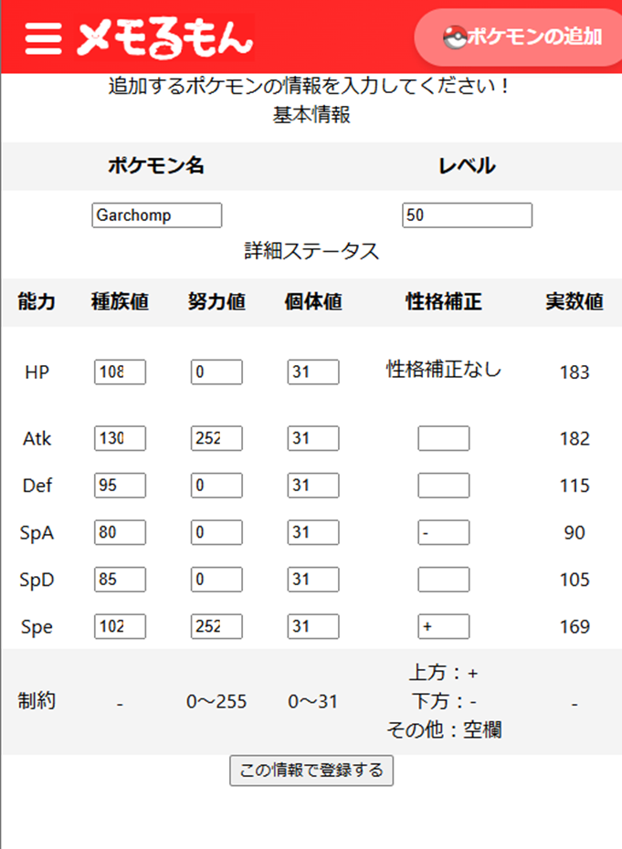
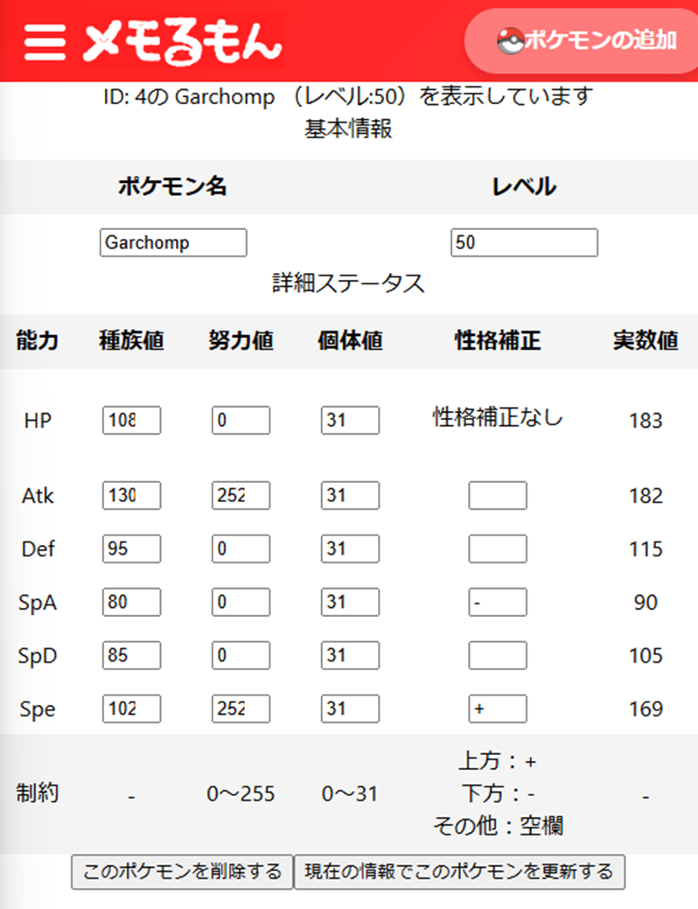

# アプリの概要

- アプリ「メモるもん」は、ポケモンの能力値を保存するためのアプリです。
- ポケモンの能力値をいつでもどこでも保存・編集することができます。

# バックエンドの環境構築

- `cd backend`で移動

- `npm i`を実行
- `createdb pokemon_data`を実行して DB を作成（もしくは`psql`でログイン後`create database pokemon_data`を実行）

- `npm run migrate`を実行してテーブルを作成
- `npm run seed`を実行してテーブルに初期データを作成

- `env.sample`を参考に`env.local`を作成
- `npm run start`を実行してバックエンドを起動

# フロントエンドの環境構築

- `cd frontend`で移動

- `npm i`を実行
- `npm start`でフロントエンドを起動

# 機能一覧・使用方法

- 現在 DB に保存されている登録したポケモンを一覧で参照することができます。

  

- 「ポケモンの追加」を押下することで、ポケモンの入力画面に移動します。
- デフォルトではガブリアスの能力値が記載されておりますが、自由に編集して登録できます。

- 一覧画面で各ポケモンのパネルを押すことで、ポケモンの詳細情報を参照できます。
- この画面でポケモンの情報を更新したり、削除したりすることもできます。
- 削除したデータは復旧できないので注意してください。

# 今後の展望

- パーティ編集機能・ダメージ計算機能を追加予定！
- そののち、PokeAPI を用いたポケモンの検索機能等実装予定！

# 使用技術

- フロントサイド：React
- サーバー：Express
- データベース：Postgres / Knex
